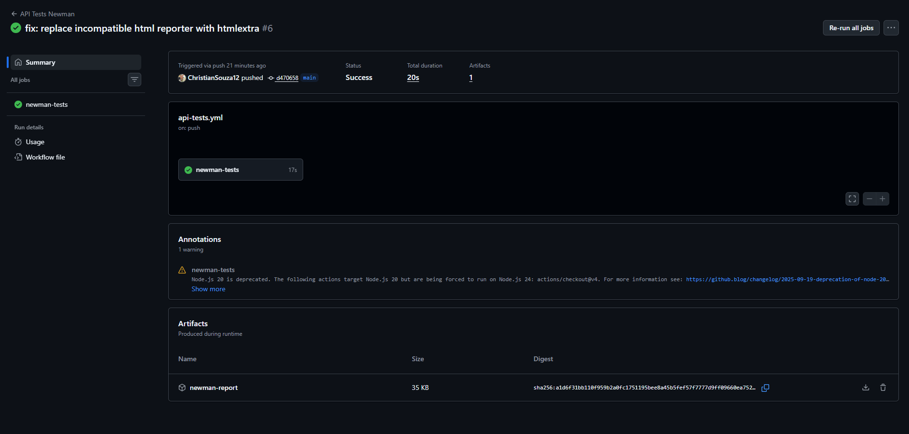
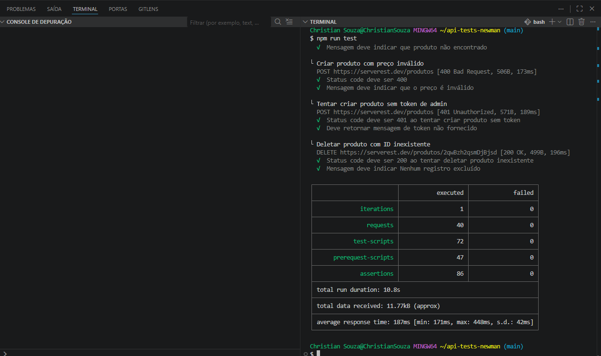
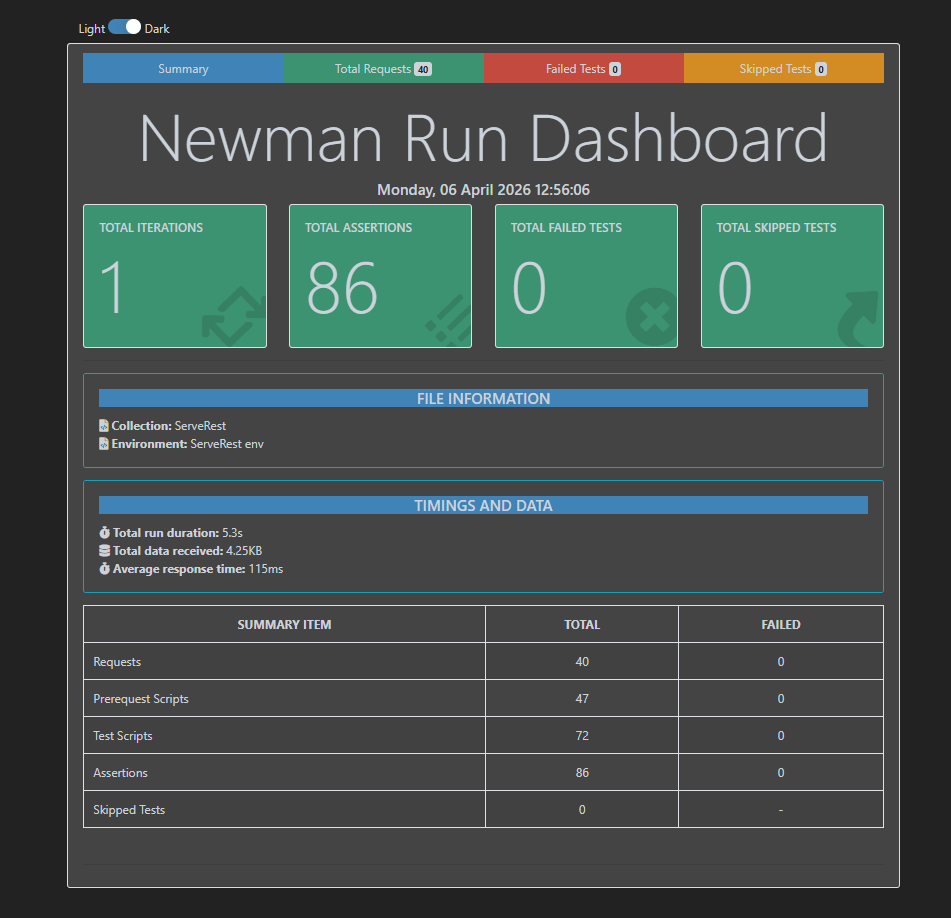

# 🚀 API Tests com Postman + Newman + CI/CD


Projeto de testes automatizados de API utilizando **Postman**, executados via **Newman** e integrados com **CI/CD no GitHub Actions**.

---

## 📌 Sobre o projeto

Este projeto tem como objetivo validar os principais fluxos da API pública do ServeRest, cobrindo:

- Cadastro de usuários
- Login e autenticação
- CRUD completo de produtos
- Validações de campos obrigatórios
- Testes negativos (erros esperados)

Os testes foram estruturados seguindo boas práticas de QA, com cenários independentes e dados dinâmicos.

---

## 🔄 CI/CD em execução



Pipeline configurada no GitHub Actions que executa automaticamente os testes a cada push ou pull request.

---

## ▶️ Execução dos testes via terminal



Execução dos testes utilizando Newman via linha de comando, exibindo resultados detalhados e métricas de execução.

---

## 📊 Relatório de testes



Relatório HTML gerado automaticamente com:

- Total de testes executados
- Sucessos e falhas
- Tempo de execução
- Detalhamento das requisições

---

## 🧪 Tecnologias utilizadas

- JavaScript
- Postman
- Newman
- Newman Reporter HTML Extra
- GitHub Actions (CI/CD)

---

## 📁 Estrutura do projeto
api-tests-newman

│── collection.json

│── environment.json

│── package.json

│── package-lock.json

│── .gitignore

└── .github/

└── workflows/

└── api-tests.yml


---

## ▶️ Como rodar o projeto localmente

### 1. Clonar o repositório

```bash
git clone https://github.com/ChristianSouza12/api-tests-newman.git
cd api-tests-newman
```


### 2. Instalar dependências
```bash
npm install
````

### 3. Rodar os testes
```bash
npm test
````

### 4. Gerar relatório HTML
```bash
npm run report 
````

## 🔐 Autenticação
Os testes utilizam autenticação via token JWT, gerado automaticamente durante a execução:

-Criação de usuário admin
-Login automático

-Token salvo dinamicamente

-Utilização nas rotas protegidas


## 🔄 CI/CD com GitHub Actions
O projeto possui integração contínua configurada.

A cada push ou pull request:


-Instala dependências

-Executa os testes com Newman

-Gera relatório HTML

-Salva como artifact no GitHub


## 📊 Relatório de testes

O relatório HTML contém:


-Total de testes executados

-Sucessos e falhas

-Tempo de execução

-Detalhamento de cada request

-Logs e respostas da API


## 📥 Para acessar:


-Vá em Actions no GitHub

-Clique no workflow executado

-Baixe o artifact newman-report

-Abra o arquivo .html


## ✅ Cenários cobertos

### Usuários

-Criar usuário com sucesso

-Campos obrigatórios

-Email inválido

-Email duplicado

-Login válido e inválido

-Listagem e busca por ID

-Atualização e remoção

### Produtos

-Validação de campos obrigatórios

### CRUD completo:

-Criar

-Buscar

-Editar

-Deletar

-Produto duplicado

-Produto inexistente

-Testes com e sem token


## 💡 Diferenciais do projeto

-Uso de dados dinâmicos para evitar conflitos

-Separação de cenários por fluxo

-Automação completa com CI/CD

-Relatório HTML automatizado

Cobertura de testes positivos e negativos
